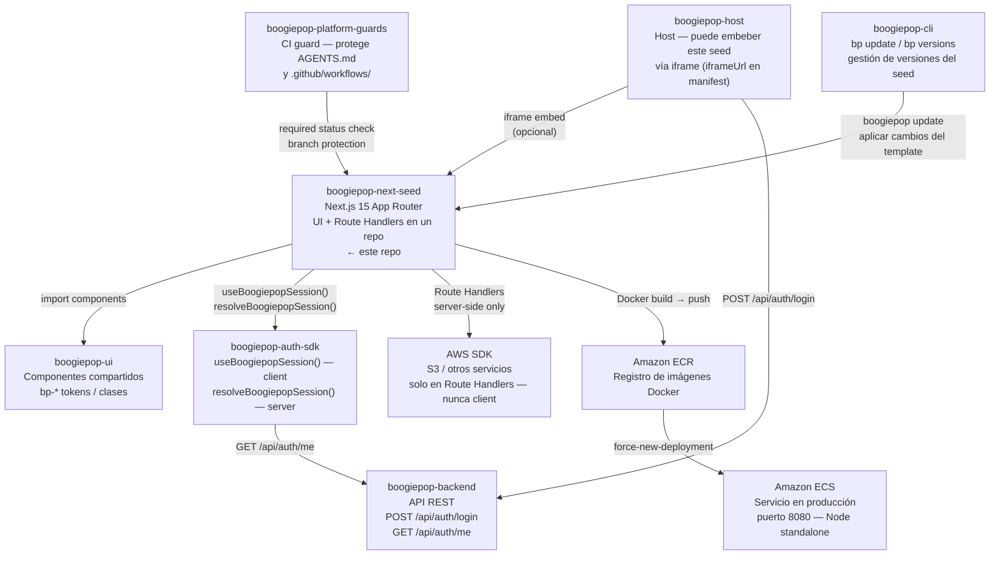

# Boogiepop · Next.js Fullstack Seed

Seed **Next.js (App Router) + React + TypeScript** con **Route Handlers** y **`@aws-sdk/*`** en el **mismo repositorio**. Desplegable con el mismo flujo que [boogiepop-react-seed](../boogiepop-react-seed): **Docker → ECR → ECS** (puerto **8080**, health **`/health`**).

---

## En la plataforma



| Parte | Rol respecto a este seed |
|-------|--------------------------|
| `boogiepop-host` | Puede embeber este seed via `iframeUrl` en el manifest del hub |
| `boogiepop-ui` | Componentes React compartidos (`Button`, `Card`, `Input`, etc.) |
| `boogiepop-auth-sdk` | Client: `useBoogiepopSession()` — Server: `resolveBoogiepopSession()` |
| `boogiepop-backend` | Provee `GET /api/auth/me`; el login vive en el host |
| AWS SDK | Usado exclusivamente en Route Handlers (server) — nunca en componentes client |
| `boogiepop-platform-guards` | Guard de CI que bloquea merges no autorizados sobre archivos protegidos |
| `boogiepop-cli` | Gestiona versiones del seed — `bp update` aplica cambios del template |
| AWS ECR / ECS | Imagen Docker `output: standalone`, servida en puerto 8080 |

---

Para convenciones de agentes: **[AGENTS.md](AGENTS.md)**.

## ¿Este seed o react-seed?

| Necesitás… | Seed |
|------------|------|
| Remote **Module Federation** en el hub (`boogiepopRemote/Shell`) | [boogiepop-react-seed](../boogiepop-react-seed) (Vite) |
| **React + API + AWS** en un solo repo, sin Nest aparte | **boogiepop-next-seed** (este) |
| Embed en el hub vía **iframe** (como Streamlit) | Este seed + `iframeUrl` en manifest |

## Qué incluye

| Incluye | Detalle |
|---------|---------|
| **Next.js 15 + React 19** | App Router, `output: 'standalone'` para Docker |
| **Route Handlers** | `app/api/aws-demo/route.ts` — demo S3 read-only |
| **Tailwind v4** | Tema tipo Streamlit claro (IBM Plex, `.st-*`) |
| **Health** | `GET /health` → `ok` (ALB/ECS) |
| **CI GitLab** | Mismo patrón que react-seed: lint → build → ECR → ECS |

## Requisitos

- **Node.js** ≥ 22 (`.nvmrc`)
- **npm** + `package-lock.json` commiteado
- AWS **ECR/ECS** solo para deploy CI (opcional en local)

## Scripts

```bash
npm ci
cp .env.example .env.local   # opcional
npm run dev                  # http://localhost:3000
npm run build
npm run start                # producción local (PORT=8080 recomendado)
npm run lint
```

## Variables de entorno

| Variable | Uso |
|----------|-----|
| `AWS_REGION` | Región del SDK (default `us-east-1`) |
| `AWS_DEMO_S3_BUCKET` | Bucket opcional para listar objetos en la demo |
| `AWS_DEMO_S3_PREFIX` | Prefijo acotado dentro del bucket |
| `PORT` | Puerto del servidor (default Next 3000 en dev; **8080** en Docker/ECS) |
| `NEXT_PUBLIC_API_BASE_URL` | Base URL de Boogiepop API para `GET /api/auth/me` en el SDK de auth |

**Local:** credenciales vía `AWS_PROFILE`, variables de entorno o `~/.aws/credentials`.  
**ECS:** task role IAM con permisos mínimos (p. ej. `s3:ListBucket` en bucket demo).

## Docker local

```bash
docker build -t boogiepop-next-seed:local .
docker run --rm -p 8080:8080 \
  -e AWS_REGION=us-east-1 \
  -e AWS_DEMO_S3_BUCKET=mi-bucket \
  boogiepop-next-seed:local
```

- App: http://localhost:8080/
- Health: http://localhost:8080/health
- Demo API: http://localhost:8080/api/aws-demo

## CI / deploy

Ver **[docs/GITLAB-DEPLOY.md](docs/GITLAB-DEPLOY.md)** e **[docs/INFRA-TERRAFORM.md](docs/INFRA-TERRAFORM.md)**.

Registro en el hub: **[docs/HUB-MANIFEST.md](docs/HUB-MANIFEST.md)**.

Resumen:

- Repo ECR por defecto: **`boogiepop-next-seed`**
- Servicio ECS por defecto: **`boogiepop-api-fe-next-seed-svc`** (crear en Terraform/infra antes del primer deploy)
- **`main`**: push imagen `:latest` + `force-new-deployment` automático
- **`develop`**: jobs Docker/ECS manuales

## Hub (manifest)

Registrá la app con **`iframeUrl`** apuntando a la URL pública del servicio (patrón Streamlit). **No** modifiques el manifest del hub desde este seed salvo pedido explícito del equipo.

## SDK auth (sin login)

Este seed consume el SDK npm `boogiepop-auth-sdk` (repo separado: `https://github.com/blanck1945/boogiepop-auth-sdk`) para que las apps consumidoras:

- no implementen login local,
- sólo consuman sesión/roles ya emitidos por el host,
- consulten `GET /api/auth/me` cuando tengan token.

API principal:

- `resolveBoogiepopSession(options?)` desde `boogiepop-auth-sdk`
- `useBoogiepopSession(options?)` desde `boogiepop-auth-sdk/react`
- `hasRole(snapshot, role)`
- `hasAnyRole(snapshot, roles)`

Patrón recomendado: **`POST /api/auth/login` sólo en host**; Next/otros remotes usan el token recibido y llaman `/api/auth/me` mediante el SDK.

## Licencia

Uso interno seed — añadí la licencia que corresponda antes de distribuir públicamente.
